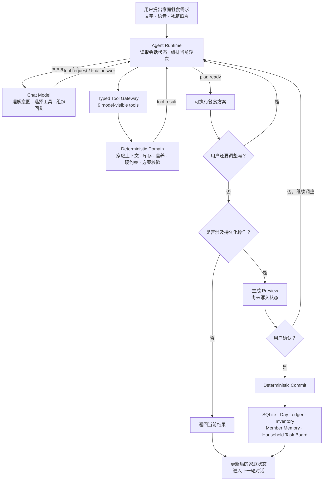
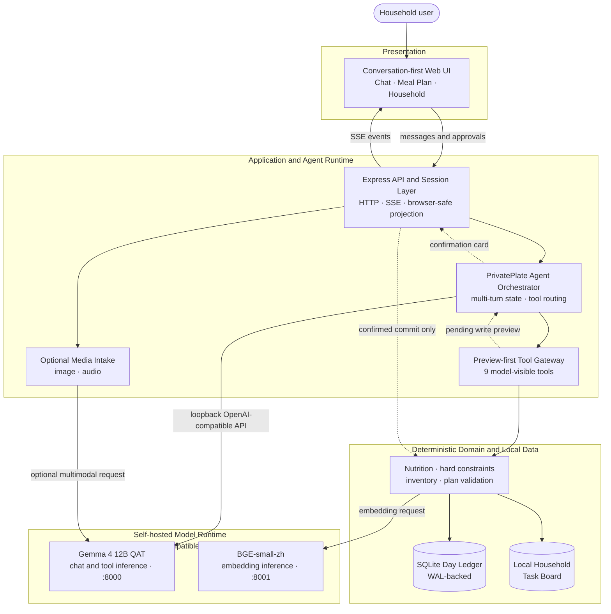

# PrivatePlate

**面向智能冰箱屏幕与浏览器设备模拟器的对话式家庭餐食协调 Agent。**

PrivatePlate 希望解决的不是“今天推荐吃什么”，而是家庭每天都在重复面对的餐食协调问题：

> 谁吃饭？冰箱里什么该先用？谁有什么不能吃？上一顿已经吃了什么？缺什么要买？最后谁来准备？

家庭成员可以直接用自然语言提出需求，例如“今晚三个人吃饭，把快过期的菜先用了，妈妈不要辣”。

PrivatePlate 会在后台结合家庭成员、库存、饮食偏好与限制、当天餐食状态等信息，通过 Agent 完成上下文读取、工具调用和方案调整，再由确定性的领域逻辑执行营养计算、安全检查、库存与状态处理，最终给出真正可以执行的结果，而不是只返回一段聊天文本。

本仓库是为 **GOAI 比赛**整理的独立可运行版本，包含 PrivatePlate 当前可公开、可验证的核心实现。

## 核心能力

当前仓库中的可运行原型已经包含：

- **多轮中文对话规划**：支持生成家庭餐食方案，并根据后续要求继续修改。
- **家庭上下文建模**：管理家庭成员、偏好、饮食限制、库存以及跨餐次的当天状态。
- **Agent 工具调用**：模型通过结构化工具读取上下文、查询库存、寻找候选菜品、生成方案、检索知识和预览后续操作。
- **确定性营养计算**：营养数值和规则判断由领域代码完成，不依赖 LLM 自行计算。
- **安全约束与隐私边界**：健康标签、营养档案等敏感规划信息保留在服务端，家庭共享屏幕只接收必要的展示信息。
- **确认后写入**：库存修改、成员记忆、餐食完成状态以及家庭任务等持久化操作均经过预览与确认边界。
- **当天餐食账本**：已完成的餐食可以进入 day ledger，影响后续餐次的规划上下文。
- **购物缺口计算**：根据最终方案和现有库存计算缺失食材。
- **家庭任务交接**：可以生成面向家庭照护者或执行者的最小必要信息任务卡。
- **语音输入**：浏览器端支持麦克风输入，并在使用前保留用户确认与编辑空间。
- **冰箱照片录入**：支持通过图片生成库存草稿，由用户检查后再进入正式状态。
- **SQLite 持久化**：保存家庭状态、库存、会话 checkpoint、待确认操作等数据。
- **本地 RAG**：支持通过独立的 OpenAI-compatible embedding endpoint 检索本地知识语料。
- **自动化评测**：仓库包含针对工具选择、参数、安全、隐私和多轮生命周期的公开 scripted evaluation。

## 一次完整的工作流程



LLM 负责理解用户意图、选择工具以及组织规划过程；确定性的 Domain 负责营养计算、硬约束、库存与状态处理。

需要写入家庭状态的动作不会由模型直接提交，而是先生成 Preview，经过用户确认后才进入确定性的 Commit 路径。更新后的状态会成为下一轮对话的新上下文。

## 架构



**写入边界：**模型看不到直接提交状态的 `commit_*` 工具。模型可见的写操作只负责生成 Preview；用户确认后，受信任的确认路径才会调用确定性的 Domain 逻辑修改 SQLite 状态。

浏览器拿到的并不是完整家庭档案，而是经过裁剪后的展示数据。详细健康标签、营养档案和规划输入保留在服务端，家庭共享屏幕只显示姓名、角色、安全的执行提示、库存事实以及已确认的结果。

## 仓库结构

```text
PrivatePlate/
├── apps/
│   ├── web/               # React / Vite 浏览器界面与设备模拟器
│   └── server/            # Express API、SSE、媒体输入与会话边界
│
├── packages/
│   ├── agent-runtime/     # Agent loop、工具路由、验证、确认流程
│   ├── contracts/         # 共享 Schema 与数据契约
│   ├── domain/            # 家庭、库存、规划、营养、账本、RAG 与 SQLite
│   └── evals/             # 自动化评测 runner、schema 与 scorer
│
├── fixtures/
│   ├── household/         # 合成家庭数据
│   ├── foods/             # Demo 食物数据
│   ├── meal-templates/    # 餐食模板
│   ├── knowledge/         # 本地 RAG 知识语料
│   └── evals/             # 公开评测案例
│
└── scripts/
    ├── rag/               # 本地 embedding / RAG 辅助脚本
    └── c1/                # fixture 校验工具
```

## 运行要求

- Node.js **22.13 或更高版本**
- npm
- 一个运行在 `127.0.0.1:8000` 的 OpenAI-compatible Chat Model endpoint
- 可选：一个运行在 `127.0.0.1:8001` 的 OpenAI-compatible Embedding endpoint

模型权重和生产环境食品数据库不包含在本仓库中。

## 本地运行

安装依赖：

```bash
npm ci
```

创建本地配置：

```bash
cp .env.example .env
```

编辑 `.env` 后加载环境变量：

```bash
set -a; source .env; set +a
```

启动服务端：

```bash
npm run dev:server
```

在另一个终端加载相同 `.env` 后启动前端：

```bash
npm run dev:web
```

打开：

```text
http://127.0.0.1:5173
```

## 验证

运行完整检查：

```bash
npm run check
```

或者运行 GOAI 对应检查：

```bash
npm run check:goai
```

检查流程覆盖：

- workspace 构建
- contracts 测试
- domain 测试
- Agent runtime 测试
- server 测试
- web 测试
- public eval v2
- TypeScript typecheck
- `git diff --check`

测试环境使用 `ScriptedProductProvider` 作为确定性的模型替身。

因此，通过测试能够证明代码路径、数据契约以及安全边界按预期工作，但不代表任何具体真实模型的生成质量已经由这些测试证明。

## 当前 Demo 的能力边界

这个仓库运行的是一个**浏览器中的智能冰箱设备模拟器**，默认首页是对话优先界面。

当前版本并没有声称已经直接接入：

- 真实冰箱传感器
- 唤醒词硬件
- 家电控制
- 自动下单或真实生鲜采购平台
- 外部即时通讯服务

语音与照片识别得到的内容也不会被视为绝对可靠的事实，而是需要用户检查的输入草稿。

Demo 中的营养数值属于工程演示数据与规则，不构成医疗建议。

### 关于“本地运行”

应用仅接受 loopback 模型地址（默认 `127.0.0.1:8000`，可选 embedding 为 `127.0.0.1:8001`）。如果这些地址实际通过 SSH tunnel 指向远程模型，则仍属于远程计算；只有模型、服务端与 SQLite 都实际运行在家庭设备本机时，才属于严格意义上的设备端本地处理。

## Demo 数据

`fixtures/` 中的数据是专门为 PrivatePlate 原型创建的 **AI-assisted synthetic demo data**。

其中不包含：

- 真实家庭记录
- 真实用户数据
- 临床数据集
- 实测营养数据库
- 第三方食品数据库的重新分发内容

数据来源与生成边界见：

- `fixtures/PROVENANCE.md`
- `fixtures/MANIFEST.json`

## 公开范围

这个仓库是从原始开发项目整理出的 clean export，而不是原始 Git 历史的完整副本。

当前包含的是能够独立运行 PrivatePlate Demo 所需的核心代码，包括：

- 浏览器应用
- 服务端
- Agent orchestration
- 数据契约
- 领域规划逻辑
- 通用营养与安全规则
- 合成 Demo fixtures
- 公开评测框架

生产食品数据库、真实用户数据、私有 regression/evaluation 数据、模型权重、商业集成、内部执行文档以及比赛提交素材不包含在本仓库中。

详细边界见 [`OPEN_SOURCE_SCOPE.md`](OPEN_SOURCE_SCOPE.md)。

## License

本仓库中实际包含的 PrivatePlate 源代码采用：

**Apache License 2.0**

见 [`LICENSE`](LICENSE)。

`fixtures/` 下的 AI-assisted synthetic demonstration data 采用：

**CC0 1.0 Universal**

见 [`DATA_LICENSE.md`](DATA_LICENSE.md) 和 `fixtures/LICENSES/CC0-1.0.txt`。

第三方依赖和模型运行时仍遵循各自的许可证与使用条款，详见 [`THIRD_PARTY_NOTICES.md`](THIRD_PARTY_NOTICES.md)。
